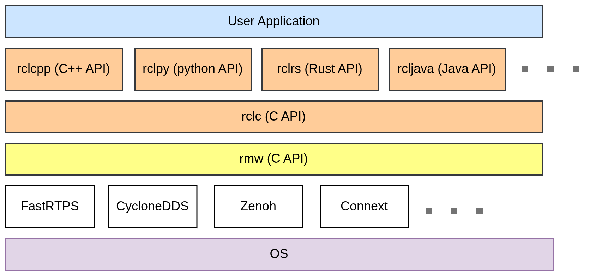

# Tutorial 4: Help & Info

#### Development of Intelligent Systems, 2026

This week you should be working on Task1. Here are some technical details to help you with the implementation.

## Coordinate Transforms

Establishing the relative positions of the many components of a robot system is one of the most important tasks to ensure reliable positioning. Each of the components, such as map, robot, wheels, and different sensors has its own coordinate system and their relationships must be tracked continuously. The static relationships (such as between different static sensors) are relatively simple, consisting of only sequential rigid transformations that need to be computed only once. The dynamic relationships, such as the relative position of the robot to the world coordinates or the positions of the robot arm joints to the camera, however, must be estimated during operation.
You can install the tools for viewing the tf2 transforms as follows:

```bash
sudo apt install ros-jazzy-tf2-tools
```

Then, while your simulation is running, you can run `ros2 run tf2_tools view_frames` to record the tree of the tf2 transformations. This will create a .pdf representation of the tf2 tree that you can analyze.
You can also request the values of the specific transformation between two coordinate frames using the command:
```
ros2 run tf2_ros tf2_echo base_link map
```
This is important for placing the observed objects (faces, rings etc.) into the map, when they will be firstly detected in the coordinate frame of the robot (or, more specifically, in the coordinate frame of the sensor). You can use the scripts included in this tutorial to get you started. You can also work through the [tutorial for the tf2 transforms](https://docs.ros.org/en/jazzy/Tutorials/Intermediate/Tf2/Introduction-To-Tf2.html): 

### Libraries for Transformations
If you do not want to write your own transformations (e.q. Euler angles to Quaternions or vice versa) you can use the following libraries:

```bash
sudo apt install ros-jazzy-tf-transformations ros-jazzy-turtle-tf2-py
pip install transforms3d --user --break-system-packages
```

Then, you can do stuff like:
```python
import tf_transformations
q = tf_transformations.quaternion_from_euler(r, p, y)
r, p, y = tf_transformations.euler_from_quaternion(quaternion)
```
## Using ROS bags

Those of you that can only work on the simulation in the lab, make use of the `ros2 bag` command line tool. It is a tool for recording all or some messages published. For example, you can run the simulation and drive to robot around the polygon, while recording the messages published (like the images from the camera). Then you can copy the `bag` file to another computer, play it, and work on face detection and clustering. The tutorial for `ros2 bag` is [here](https://docs.ros.org/en/jazzy/Tutorials/Beginner-CLI-Tools/Recording-And-Playing-Back-Data/Recording-And-Playing-Back-Data.html).

### map_goals.py

In the demo package this week, you have a node that sends a navigation goal to the robot by clicking on the map. This demo package illustrates some ideas, like how you can read the map from the topic and convert it to a numpy image, how you can convert from pixel coordinates to real world coordinates and more. Download, build, test, and explore the code.

### transform_point.py

The other script in this package demonstrates how you can use the TF2 libraries to do transformations between frames. This node first creates a point that is 0.5m behind of the robot (in its header the frame_id is "base_link"). Then it looks up the transformation between the "base_link" and the "map" frames, and then applies the transformation to the point so it is transformed in the "map" frame. Finally, it creates a marker from the point and publishes it, so you can see it in Rviz on the `/breadcrumbs`topic.

See [the documentation page](https://docs.ros.org/en/jazzy/Tutorials/Intermediate/RViz/Marker-Display-types/Marker-Display-types.html) for the available marker types and more info.

## Saying Hello

As part of Task1, your robot needs to say something when it approaches a detected face. To do this, you can simply record an audio file, and use a module like `playsound` (that you install with `pip install playsound`). There are also other modules for playing sounds: `pydub`, `simpleaudio`, or using the `os` library and playing the sound with your system player.     

A more interesting approach, and one that will also prove useful in the future, is using a text-to-speech (TTS) generator. This is currently a very active research field, and you have many different options for TTS generators. There are simple ones, complex ones, there are those that run on-device, and those that run in the cloud, you can even try to train a deep model for imitating some voice. 

For our purposes, the quality of the generated voice does not matter, so do as you wish. Some modern include (in roughly increasing order of quality and compute required):
- [espeak-ng](https://github.com/gooofy/py-espeak-ng)
- [Piper TTS](https://github.com/OHF-Voice/piper1-gpl)
- [Kitten TTS](https://github.com/KittenML/KittenTTS)
- [Kokoro TTS](https://github.com/nazdridoy/kokoro-tts)
- [Qwen3-TTS](https://github.com/QwenLM/Qwen3-TTS)

<br>

# ROS Middleware (RMW) Guide

ROS 2 is built on top of a data distribution abstraction which provides topic discovery, message serialization and network transport. This layer is usually handled by a [Data Distribution Service](https://www.omg.org/omg-dds-portal/) (DDS) such as CycloneDDS and FastDDS, however a RMW can be anything that conforms to the specification (e.g. [rmw_email](https://github.com/christophebedard/rmw_email)) and can act as a drop-in replacement. Not all RMWs are made equal however, and when something doesn't work correctly in ROS 2, the problem is usually the DDS.


*ROS 2 Message Stack*

When a node is initialized it will use the rmw API to try and connect to other nodes using the specified RMW (you can check what's currently being used with `echo $RMW_IMPLEMENTATION`) and declare its publishers and subscribers. This can involve a central server that runs as the `ros2 daemon` service, or be done on a peer-to-peer basis. 

A consequence of using DDS-based RMWs are Quality of Service (QoS) policies which can set topics to be reliable (like TCP), as best-effort (like UDP), or persistent. More on [QoS settings](https://docs.ros.org/en/jazzy/Concepts/Intermediate/About-Quality-of-Service-Settings.html#id6). It is important that a publisher and subscriber use a compatible QoS, otherwise communication cannot take place.

[More advanced info](https://docs.ros.org/en/jazzy/Concepts/Advanced/About-Internal-Interfaces.html).

### Environment variable config

If you want to use multiple computers in parallel, your computers should have the appropriate environment variables set up.  For this, you can set a `ROS_DOMAIN_ID` variable, so that ROS 2 will limit the visible nodes/topics only to those that are running under the same `ROS_DOMAIN_ID`. 

All RMWs support the `ROS_DOMAIN_ID` setting:
```bash
export ROS_DOMAIN_ID=<number from 0 to 99>
```

[iRobot's Create3 documentation](https://iroboteducation.github.io/create3_docs/setup/xml-config/#cyclonedds) is a good resource on RMW configuration.

------

### FastRTPS Env variables

In Jazzy, the preconfigured middleware is [FastDDS](https://docs.ros.org/en/jazzy/Installation/RMW-Implementations/DDS-Implementations/Working-with-eProsima-Fast-DDS.html), so one does not have to explicitly declare it. By default it attemps to connect to any other nodes using **simple discovery mode** on the network. That approach is generally not very reliable, so it's best to restrict node discovery to a single machine using:

```bash
export ROS_LOCALHOST_ONLY=1
export RMW_IMPLEMENTATION=rmw_fastrtps_cpp
```

It can also operate using a **discovery server** which acts as a central database of available nodes and topics, which can be more reliable for multi-machine configurations, but requires extensive configuration on both ends. More [info](https://fast-dds.docs.eprosima.com/en/3.x/fastdds/ros2/discovery_server/ros2_discovery_server.html).

### Zenoh Env variables

[Zenoh](https://docs.ros.org/en/jazzy/Installation/RMW-Implementations/Non-DDS-Implementations/Working-with-Zenoh.html) is a new and most promising RMW, designed for minimal overhead and tends to be the fastest. Unlike other RMWs, it currently requires explicitly running a router which relays traffic and handles discovery. After installing it, it can be enabled using:

```bash
export RMW_IMPLEMENTATION=rmw_zenoh_cpp
```

Zenoh runs only on localhost by default. You can connect nodes directly to an existing zenohd router on another PC at e.g. 192.168.1.10:
```bash
export ZENOH_CONFIG_OVERRIDE='mode="client";connect/endpoints=["tcp/192.168.1.10:7447"]'
```

### Cyclone Env variables

[Cyclone](https://docs.ros.org/en/jazzy/Installation/RMW-Implementations/DDS-Implementations/Working-with-Eclipse-CycloneDDS.html) is more compute intensive than FastDDS or zenoh, however it performs very reliably at multi-machine node discovery.

```bash
export CYCLONEDDS_URI='/home/rins/cyclonedds.xml'
export RMW_IMPLEMENTATION=rmw_cyclonedds_cpp
```

The `cyclonedds.xml` config file can either declare which network interfaces Cyclone should use, or let it figure things out by itself:

```xml
<CycloneDDS>
   <Domain>
     <General>
        <Interfaces>
          <NetworkInterface autodetermine="true" />
        </Interfaces>
        <DontRoute>true</DontRoute>
    </General>
   </Domain>
</CycloneDDS>
```

```xml
<CycloneDDS>
   <Domain>
     <General>
        <Interfaces>
          <NetworkInterface name="eth0" />
          <NetworkInterface name="wlan0" />
        </Interfaces>
        <DontRoute>true</DontRoute>
    </General>
   </Domain>
</CycloneDDS>
```

It can also be set to a loopback interface which restricts it to only localhost:

```xml
<CycloneDDS>
  <Domain>
    <General>
      <Interfaces>
        <NetworkInterface name="lo" />
      </Interfaces>
      <DontRoute>true</DontRoute>
    </General>
  </Domain>
</CycloneDDS>
```
In this case multicast might need to be additionaly enabled on lo, depending on your OS. 

For Ubuntu: `sudo ip link set lo multicast on`

